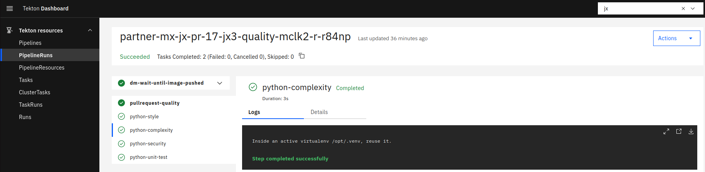

## 1. Overview

This document outlines how to use Tekton Dashboard instead of jx-pipelines-visualizer.

## 1.1 Motivation

The idea is to have less to maintain inside the jx3 ecosystem, step by step, starting with the Dashboard
I personnaly like their Dashboard, and want to use as most as possible Tekton features

## 1.2 Goal

The goal is that instead of using jx-pipelines-visualizer with his own log persistency, we can use Tekton Dashboard with Tekton Results in order to persist Logs.

## 1.3 Requirements
```
Kubernetes version: 1.22.x
Tekton Pipeline version: 0.42.0
```

## 1.4 Screenshot of Tekton Dashboard



## 2. Design proposal

### 2.1 How to have Tekton Dashboard with Logs persistency

- Tekton Dashboard Helm Chart can be added in the repostiory [cdfoundation/tekton-helm-chart](https://github.com/cdfoundation/tekton-helm-chart/tree/main)
  - this [installing-tekton-dashboard documentation](https://tekton.dev/docs/dashboard/install/) can help to create the helm chart
- Tekton Results Helm Chart can be added in the repostiory [cdfoundation/tekton-helm-chart](https://github.com/cdfoundation/tekton-helm-chart/tree/main)
  - this [Installing Tekton Results documentation](https://github.com/tektoncd/results/blob/main/docs/install.md#installing-tekton-results) can help to create the helm chart
- Both Tekton Dashboard & Tekton Results can be added as optional and configured in [jenkins-x/jx3-versions](https://github.com/jenkins-x/jx3-versions)
  - Add [Tekton Results queryable gRPC API server ](https://github.com/tektoncd/results/tree/main/docs/api) as a fallback source for logs with the Tekton Dashboard argument `--external-logs`
    - fallback is useful after the PipelineRun / TaskRun or backing Pod has been deleted to retrieve logs

### 2.2 How to configure Lighthouse to use Tekton Dashboard ?

- [.Values.env.LIGHTHOUSE_DASHBOARD_TEMPLATE](https://github.com/jenkins-x/jx3-versions/blob/master/charts/jxgh/lighthouse/values.yaml.gotmpl#L28) && [.Values.tektoncontroller.dashboardTemplate](https://github.com/jenkins-x/jx3-versions/blob/master/charts/jxgh/lighthouse/values.yaml.gotmpl#L24)
  - override them to "" in order to have this default value that represent the tekton dashboard url to pipelineruns:
    - `fmt.Sprintf("%s/#/namespaces/%s/pipelineruns/%s", trimDashboardURL(r.dashboardURL)`
    - [source](https://github.com/jenkins-x/lighthouse/blob/v1.11.10/pkg/engines/tekton/controller.go#L200-L202)

- [.Values.tektoncontroller.dashboardURL](https://github.com/jenkins-x/jx3-versions/blob/master/charts/jxgh/lighthouse/values.yaml.gotmpl#L23)
  - override it to the url of tekton dashboard

## 3. Affected repositories

As outlined above the following repositories need changes:

- [ ] `cdfoundation/tekton-helm-chart`
- [ ] `jenkins-x/jx3-versions`
- [ ] `jenkins-x/lighthouse`

## 4. Current limitation of using Tekton Dashboard

If we want to Rerun a Tekton PipelineRuns through the Tekton Dashboard instead of using `jx pipeline start`, this will only create a PipelineRun without creating the associated Jx3 PipelineActivity. Then the associated Github Status normally updated by Lighthouse won't be at all here because Lighthouse is only watching for PipelineActivity and not PipelineRun.
